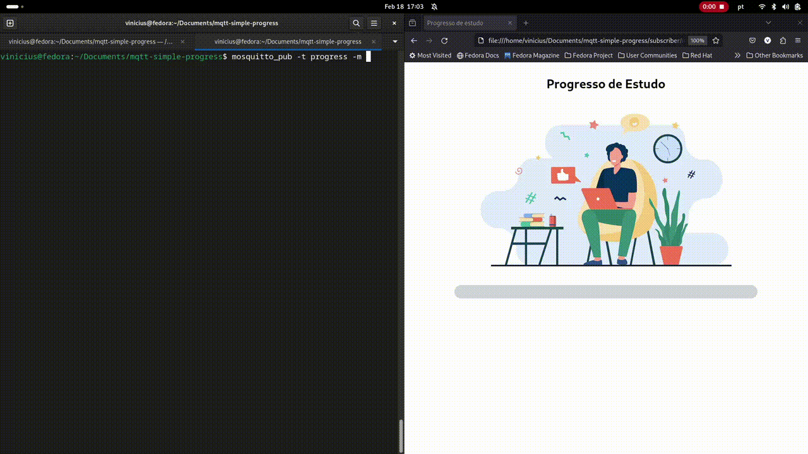

# Progresso Simples com protocolo MQTT

Este projeto é uma simples prova de conceito sobre uso do RabbitMQ como MQTT broker para implementação do pub/sub com mosquitto e javascript, respectivamente.

A ideia é criar um cenário de envio de progresso de modo a evitar pooling na API.

## Setup

Execute o docker-compose para subir o broker com rabbitmq:

```
docker-compose up -d
```

## Subscriber

Usando a biblioteca [MQTT.js](https://github.com/mqttjs), o subscriber estará aguardando as mensagens publicadas. Para este exemplo, usaremos um número inteiro que represente a porcentagem de progresso de consumo.

Em seu navegador, abra o arquivo index.html localizado na pasta subscriber. A página deve conectar sob websocket ao rabbitMQ e podemos conferir a conexão ativa através do dashboard do rabbitmq. 

## Publisher

Neste primeiro momento, usaremos o [Eclipse Mosquitto](https://mosquitto.org) para envio da mensagem através do terminal. Primeiro, instale o mosquitto em sua máquina (abaixo o exemplo no fedora):

```
dnf install mosquitto
```

Agora abra o terminal e publique um valor numérico de progresso (ex: valores entre 0 e 100)

```
mosquitto_pub -t progress -m 20
```

`progress` refere-se ao nome do tópico para onde será enviado a mensagem.

## PHP Publisher

Para ampliar a experiências desse exemplo, também é possível enviar uma mensagem com produtor em php, localizado na pasta `/publisher`. Instale a dependência via composer e execute o arquivo index.php, alterando o valor do progresso diretamente no código:

```
composer install
php index.php
```

Pronto!
## Exemplo em funcionamento


